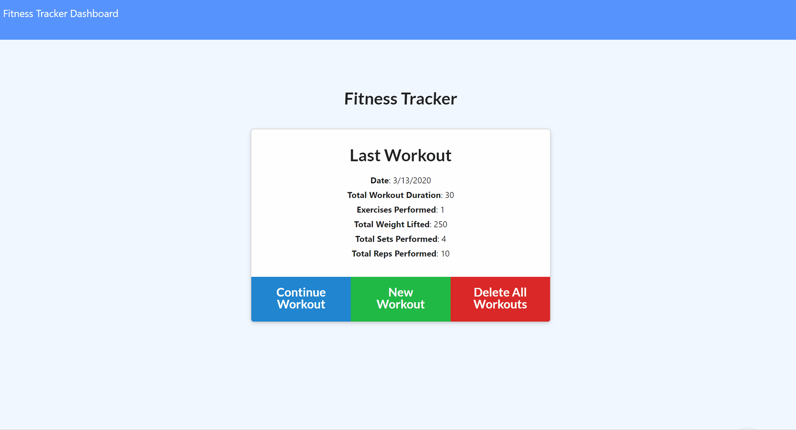

# Workout-Tracker
A Fitness application that enables users to view/create/track/delete daily workouts.

# Features
- Users are given the options when the page loads: 
    - Options:
        - To create a new workout
        - To continue with their last workout
        - To delete all existing workouts
- Users are able to:
    - Track name, type and duration of exercise plus
        - Weight, sets, reps (if resistance exercise)
        - Distance traveled (if cardio exercise)
    - Add exercises to a previous workout plan
    - Add new exercises to a new workout plan
    - Delete all workout plans previously created
    - View the combined duration and weight of multiple exercises on the dashboard page
    
# Screenshots

# Tech/framework used
* Programming Languages: JavaScript/jQuery, HTML, CSS
* Browser Based Technologies: Responsive Design, Semantic-UI
* Databases: MongoDB with a Mongoose schema
* Deployment: Heroku, Git
* Server-Side Deployment: Express.js, Node.js
* Library/Package: Compression, Morgan
* Other tools: Visual Studio Code

# Live link
* [Workout-Tracker](https://whispering-woodland-10335.herokuapp.com/) 
